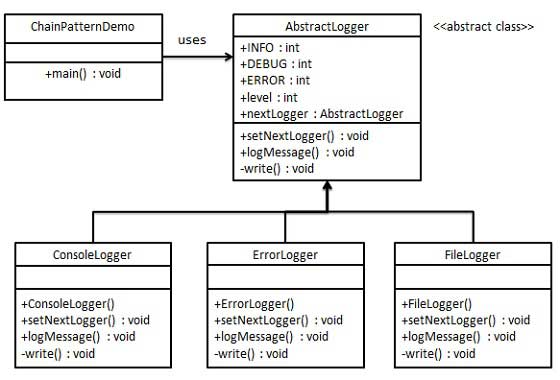
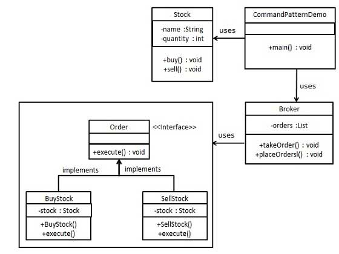
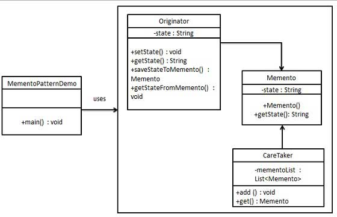

= 行为型模式

这些设计模式特别关注对象之间的通信。

== 责任链模式（Chain of Responsibility Pattern）

实现类A中以成员变量的形式包含另一个实现类B，在A的函数的方法体内执行B的函数

形成链式传递实体对象

== 命令模式（Command Pattern）

将实体对象中的执行函数升级为命令类，操作当前实体对象

== 解释器模式（Interpreter Pattern）

可利用场景比较少，JAVA 中如果碰到可以用 expression4J 代替。

image::../images/解释器.jpg[]

== 迭代器模式（Iterator Pattern）

固定写法，参考List

image::../images/迭代器.jpg[]

== 中介者模式（Mediator Pattern）

在实体对象的多对多关系中，插入中介者

举例：MVC 框架，其中C（控制器）就是 M（模型）和 V（视图）的中介者。

image::../images/中介者.jpg[]

== 备忘录模式（Memento Pattern）

将实体对象中的状态类（或其他变量），保存在外部，并（可以）记录每一次的变化

举例：Windows 里的 ctri + z

== 观察者模式（Observer Pattern）

在实体对象中以成员变量的形式设置观察者（数组），在执行函数时，通知观察者

image::../images/观察者.jpg[]

== 状态模式（State Pattern）

将实体对象中的状态类相关执行函数升级为状态执行类

image::../images/状态.png[]

== 空对象模式（Null Object Pattern）

为实体对象增加一个空对象实体类，使用这个类的实例代替null，表示一个无法完成任何动作的实例，或是提供默认行为

image::../images/空对象.jpg[]

== 策略模式（Strategy Pattern）

在实体对象中以成员变量的形式设置策略对象，执行函数方法体中执行策略

image::../images/策略.jpg[]

== 模板模式（Template Pattern）

实体对象中增加模板函数，模板函数方法体中执行其他函数，由实体对象的实现类去实现其他函数方法体

image::../images/模板.jpg[]

== 访问者模式（Visitor Pattern）

实体对象增加accept函数，参数是访问者，访问者可以访问当前实体对象的实例

image::../images/访问者.jpg[]