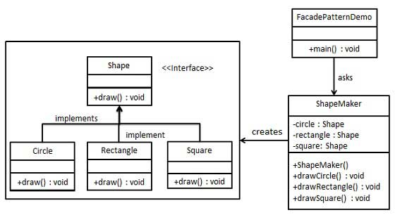
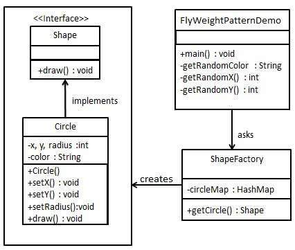

= 结构型模式

这些设计模式关注类和对象的组合。

继承的概念被用来组合接口和定义组合对象获得新功能的方式

== 适配器模式（Adapter Pattern）

image::../images/适配器.jpg[]

== 桥接模式（Bridge Pattern）

image::../images/桥接.jpg[]

== 过滤器模式（Filter、Criteria Pattern）

image::../images/过滤器.jpg[]

== 组合模式（Composite Pattern）

image::../images/组合.jpg[]

== 装饰器模式（Decorator Pattern）

image::../images/装饰器.jpg[]

== 外观模式（Facade Pattern）

== 享元模式（Flyweight Pattern）

== 代理模式（Proxy Pattern）

image::../images/代理.jpg[]